Qiscus is an AI compliant, secure and flexible chat SDK for apps and websites. They also provide multichannel customer service chat solution which is now getting popular as it is best designed for everyone to enhance their customer service experiences using multiple channels and bot-human collaboration customer service. In this section, we will learn on how to connect our bot with Qiscus thorough these following steps.

## Create Qiscus Channel

1. First thing first, you need to register yourself at [Qiscus Multichannel CS Chat Website](https://multichannel.qiscus.com) to create a new app. You will be asked to fill in several information regarding your account.
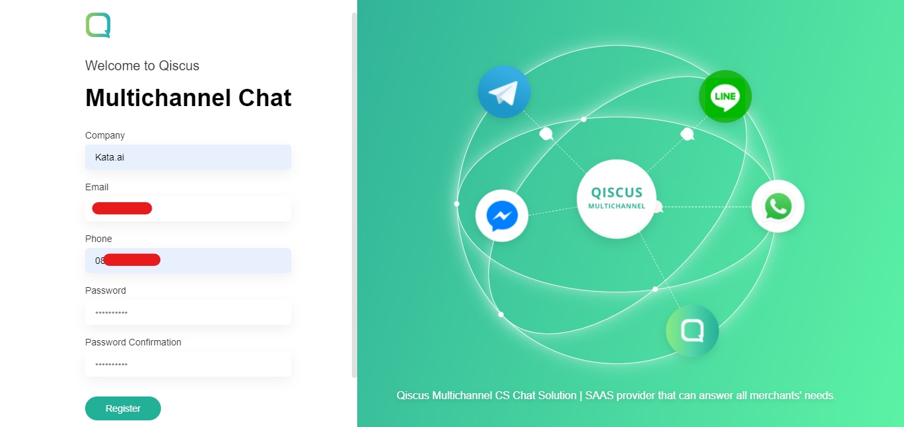

2. As soon as you signed up, you will get an email verification from Qiscus Multichannel CS Chat that you need to verify before you can use it. So just check your email and verify it.
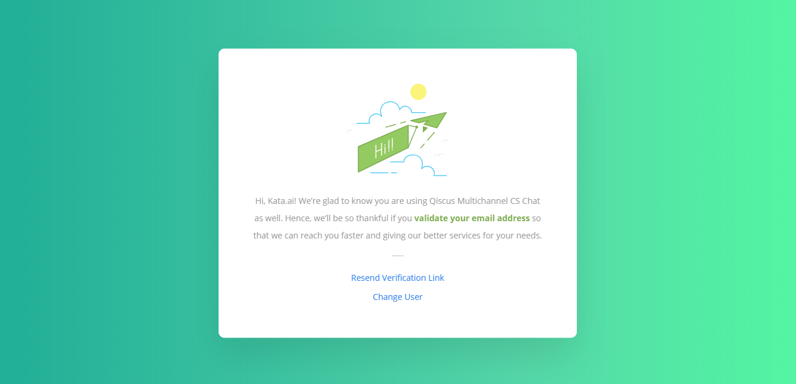

3. After you verified your account, you can log into the Qiscus Multichannel CS Chat dashboard via [login page](https://multichannel.qiscus.com). Please fill in your credentials to get in to the dashboard.

4. Once you logged in, go to the integration page, and enable the "Qiscus Widget" tab like shown on picture below.
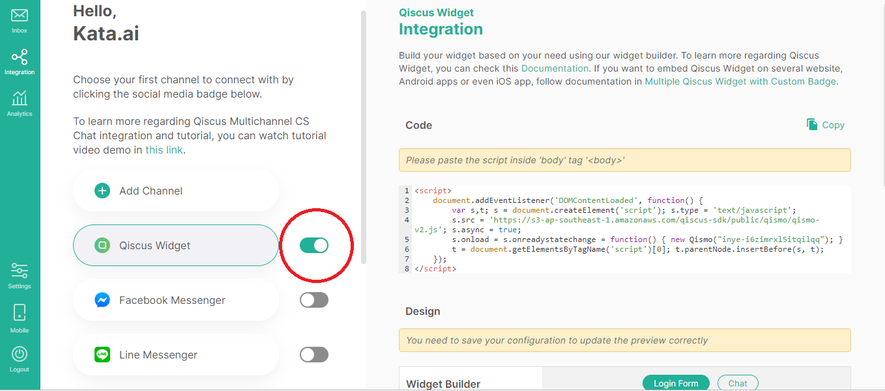

5. Copy the snippet code shown on the page and paste it into your website html. It is not set yet, you can open your html later after you integrate the bot.

6. As predicted, the next step is you need to integrate the bot by enabling the "Bot Integration" in the Integration Page. You will also see Agent ID, App ID, Qiscus Secret Key, URL. These four things will be needed later in defining new channel in Kata Platform. There's also one blank space in "Bot Webhook URL" which can be filled later if you've created the channel in Kata Platform.
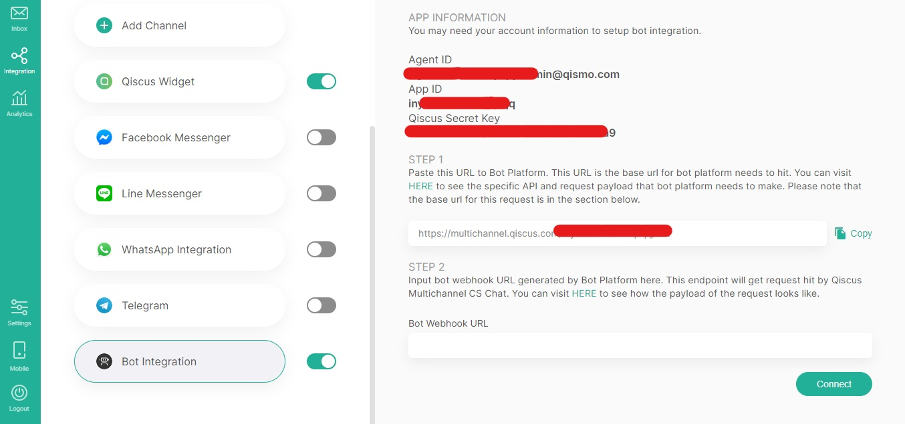

## Create Qiscus Channel in Kata Platform

First, login to Kata Platform and select the project that you want to integrate with Qiscus. Then, deploy the project by selecting "Deploy" > "New Deployment".
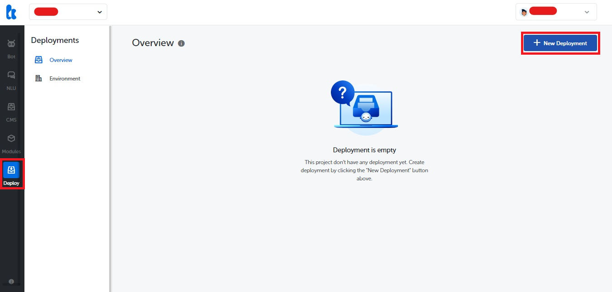

Choose the Deployment Version and fill the Deployment Change Log.
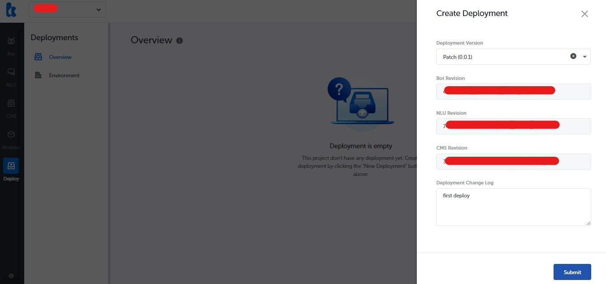

After you deployed the project, you need to choose your desired environment to create Qiscus channel by going through "Environment" > "Create Environment".
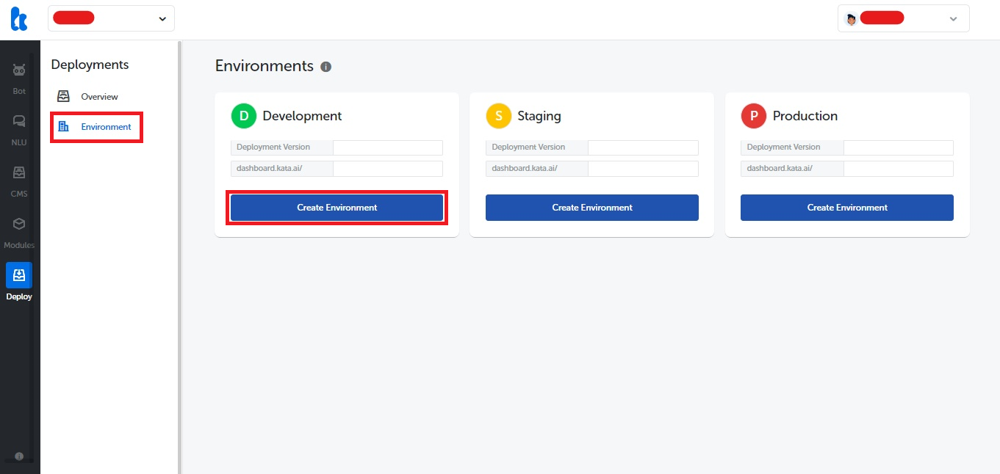

Fill the "Environment URL" and click "Create".
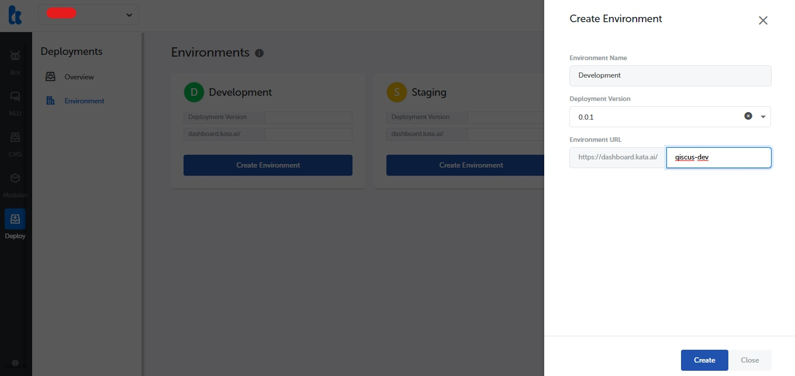

Now, you should create the channel by selecting "Create Channel".

You will now see the "Create Channel" screen. Insert the channel name, and select Qiscus as the channel type.
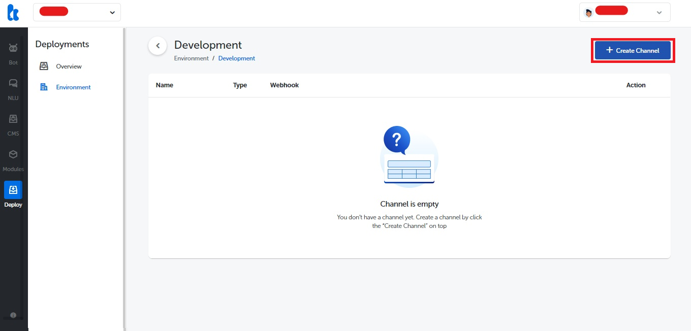
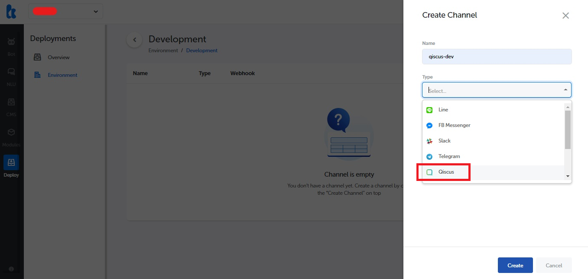

Then, copy and paste the previously Secret Key, Bot Email, and URL, and click "Create".
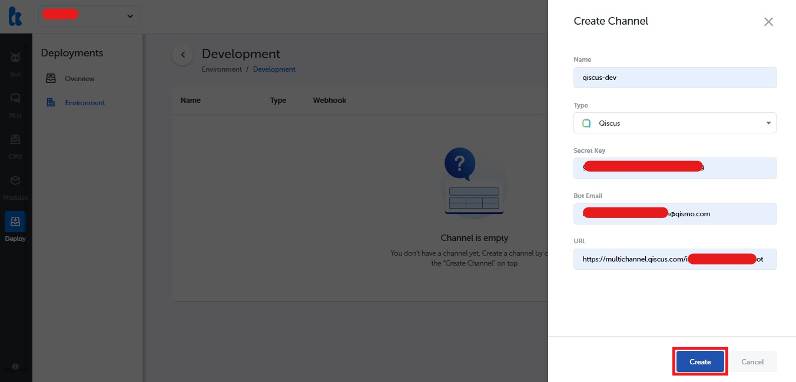

## Setup Webhook URL in Qiscus Bot

Once finished, you will see the newly-created channel in the list. You will also see a Webhook URL for your channel. This webhook URL will be added to the Qiscus bot. Copy the webhook URL by clicking the copy button next to the Webhook URL field.
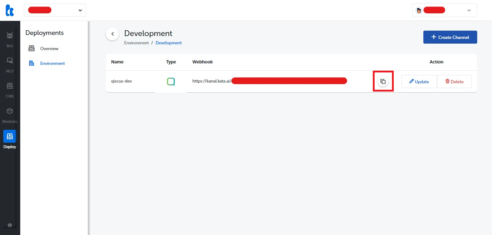

Next, back to Qiscus dashboard, and go to "Bot Integration" tab. Make sure you've enabled it, then paste the webhook URL in "Bot Webhook URL", and click "Connect".
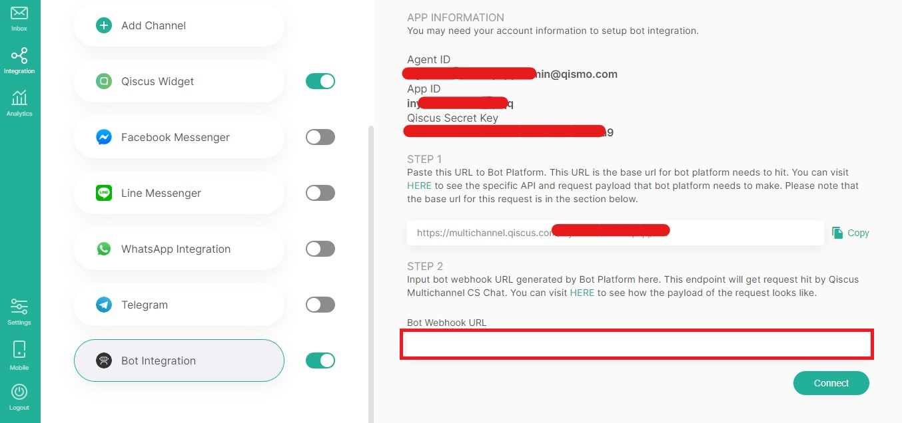

Now, you can check your Qiscus bot in the Qiscus widget by accessing your previous html file. And, voila! It works! You can now share your newly created chatbot with your friends.

